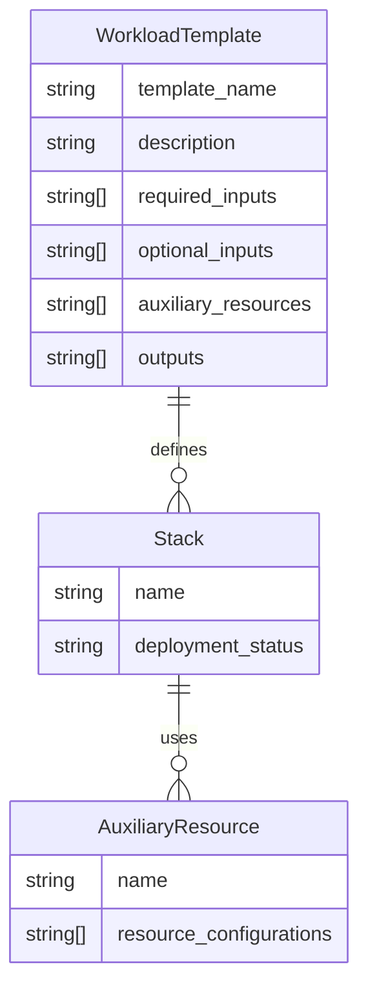

This `prototype` code demonstrates how to use AWS CDK and Python Flask to stand up a `resource controllers` service as part of a `control plane`. The primary objective of this service is to abstract away AWS resource management complexities to run various workloads such as APIs, WebApps, MLOps, etc., in a standard yet flexible and extensible manner.

# Technical Brief

## Concepts

### Workload Templates

Stored inside the `workload-templates` folder, a set of `.yaml` files defines all the types of workloads that can be managed by this `resource controllers` service. Examples are api_container, batch_data_processing, web_application, ml_ops etc.

### Stacks

An orchestrator that stands up or destroys a CDK stack needed for a given type of workload template. In this example, a standard container workload for APIs will be deployed to the AWS AppRunner service.

### Auxiliary Resources

Provides reusable resources across workload templates. For example, `s3_bucket.py` helps create an S3 bucket for the stack.

For easier understanding,



---

This service exposes the following API endpoints:

### 1. GET `/workload-templates`

Returns all the templates available for the developer. Use `?long=true` to return all required and optional inputs, output signatures, and auxiliary resources needed alongside the APIs. Auxiliary resources can be sent via the `resources` list.

```json
[
  {
    "template_name": "api_container",
    "description": "Generic service template for deploying containerized API workloads to AWS App Runner. Works with any image from ECR. Requires a service name, image URI, and optional environment variables.",
    "required_inputs": [
      {
        "description": "Unique name for the deployed service",
        "name": "service_name",
        "type": "string"
      },
      {
        "description": "Name of the ECR repository (must exist)",
        "name": "ecr_repo",
        "type": "string"
      },
      {
        "description": "Tag of the image in the ECR repository",
        "name": "image_tag",
        "type": "string"
      }
    ],
    "optional_inputs": [
      {
        "description": "Environment variables to inject into the container (key-value pairs)",
        "name": "env",
        "type": "map"
      },
      {
        "default": "1024",
        "description": "CPU size for the container (256, 512, 1024)",
        "name": "cpu",
        "type": "string"
      },
      {
        "default": "2048",
        "description": "Memory size in MB (512, 1024, 2048, 3072, 4096)",
        "name": "memory",
        "type": "string"
      },
      {
        "name": "resources",
        "type": "map",
        "description": "Optional AWS resources to provision alongside the App Runner service. Each resource supports a list of entries, where each entry may include:\n  - name: logical name for the resource (used in outputs, environment, etc.)\n  - properties: (optional) map of AWS-specific configuration\n"
      }
    ],
    "outputs": [
      {
        "name": "service_url",
        "type": "string",
        "description": "The public URL of the App Runner service"
      },
      {
        "name": "status",
        "type": "string",
        "description": "Deployment status (e.g., deployed, failed)"
      }
    ]
  }
]
```

### 2. POST `/deploy`

Deploys the workload.

**Deploy just the API:**

```json
{
  "template_name": "api_container",
  "image_repo": "core_search",
  "image_tag": "latest",
  "service_name": "core_search"
}
```

**Deploy API along with an auxiliary resource (S3) with default configs:**

```json
{
  "template_name": "api_container",
  "image_repo": "core_search",
  "image_tag": "latest",
  "service_name": "core_search",
  "resources": [
    {
      "type": "s3",
      "name": "core_search"
    }
  ]
}
```

**Tweak S3 configs to suit your needs:**

```json
{
  "template_name": "api_container",
  "image_repo": "core_search",
  "image_tag": "latest",
  "service_name": "core_search_delete",
  "resources": [
    {
      "type": "s3",
      "name": "core_search_delete",
      "properties": {
        "object_lock_enabled": true,
        "versioned": true,
        "removal_policy": "retain",
        "encryption": "kms"
      }
    }
  ]
}
```

### 3. POST `/destroy`

Uninstall/clean up.

**Uninstall the API and resources attached to it:**

```json
{
  "service_name": "core_search"
}
```

---

# Local Development Setup

## Create Python venv

```sh
python -m venv venv
```

## Activate venv

```sh
source venv/bin/activate
```

## Set up your AWS credentials

```sh
export AWS_ACCESS_KEY_ID={{your_key}}
export AWS_SECRET_ACCESS_KEY={{your_secret}}
export AWS_DEFAULT_REGION={{your_region}}
```

## Install dependencies

```sh
pip install -r requirements.txt --no-cache
```

## Run locally

```sh
make run-local
```

## Build and run Docker container

```sh
make build-docker
make run-docker
```
